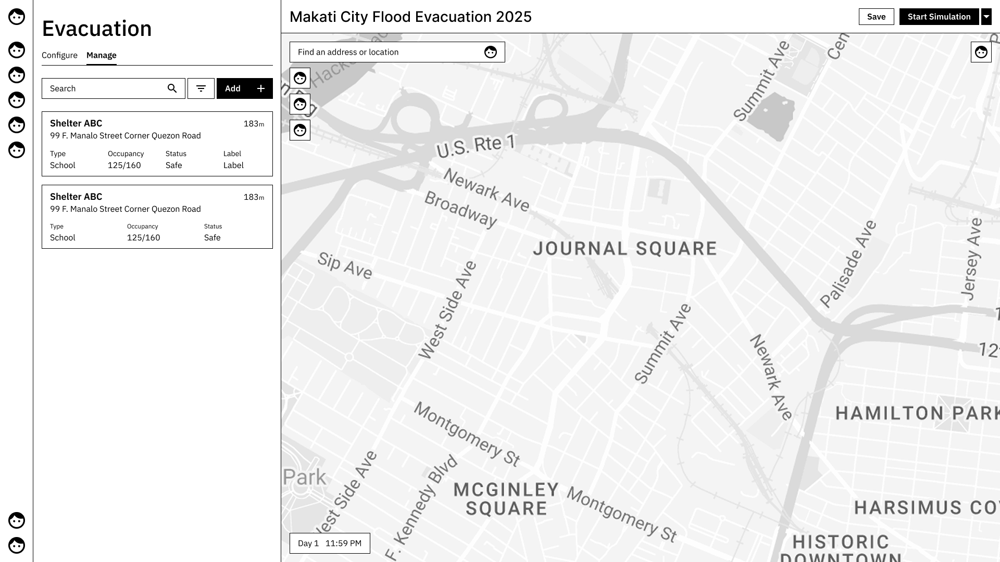

<!-- markdownlint-disable MD033 MD041 MD045-->

<div align=center>

<a href="">
  
</a>

<h1>Arus Evac</h1>

<strong>Evacuation planning through scenario-based simulation.</strong>



</div>

<!-- markdownlint-restore -->

## About The Project

Arus Evac is an evacuation planning tool that helps planners review and explore evacuation plans through simulated scenarios. It models the full evacuation cycle, including evacuation, shelter stays, and the return of residents to their homes.

The tool is designed to provide insights rather than exact or authoritative results. For example, selecting a public school as an evacuation site can illustrate potential impacts such as the number of students whose education may be disrupted, estimated shelter occupancy, and the surrounding areas likely to be served by that shelter. Users may input their own data when available. When data is missing, the system may rely on clearly indicated assumptions.

> [!IMPORTANT]
> Arus Evac functions as a decision-support tool and does not replace professional judgment. Any assumptions, estimates, or simulated outcomes are illustrative in nature. **Responsibility for planning decisions and their real-world outcomes remains with the user.**

## Getting Started

This section explains how to set up your local development environment so that you can start developing as quickly as possible.

This guide assumes you are **not familiar or comfortable** with terminals, shell commands, or system tools.

Please follow the steps **exactly as written** and do not skip steps.

If you want full explanations and background (why these tools are needed, what the commands do, and how to troubleshoot deeper issues), see:

👉 `docs/environment-setup.md` (TBA)

## Supported Environments

This project was mainly developed and tested on **Linux (Arch-based distributions)**.

The following environments are supported:

- **Linux** (primary development environment)
- **Windows 11** (supported, with additional setup)
- **Windows + WSL** (treated as Linux; separate guide planned)

> [!NOTE]
> Some tools and workflows used by this project assume a Linux-like environment.  
> Using Windows may require extra steps and stricter adherence to this guide.

## Windows Setup (Do Not Follow)

This section walks you through setting up a Windows environment that closely matches the expected development setup.

> [!WARNING]
> **Do NOT run PowerShell as Administrator** unless explicitly told to do so.  
> Running as admin can cause permission issues later and make debugging harder.

All commands below must be run in **PowerShell 7 (non-admin)**.

### Prerequisites (Windows)

You will install the following tools:

- **PowerShell 7**  
  The shell (terminal) we will use for all commands.

- **Scoop**  
  A tool that installs and manages programs in a consistent way.

- **Git**  
  Used to download the project source code, manage versions, and contribute changes.

- **Node.js v24 (LTS)**  
  The required runtime to run and develop this project.

> [!NOTE]
> If you already have Node.js installed, it may **conflict** with the required version.  
> This guide ensures the correct version is used.

### Installation

#### 1. Check if PowerShell 7 Is Installed

PowerShell 7 is **not included by default** with Windows.

1. Press **Start**
2. Search for **PowerShell 7**
3. If you see it, open it (**do not run as Administrator**)

If you do **not** see PowerShell 7, follow this guide from [Microsoft](https://learn.microsoft.com/en-us/powershell/scripting/install/install-powershell-on-windows?view=powershell-7.5).

After installing, **close all terminals**, reopen **PowerShell 7**, then continue.

#### 2. Verify You Are Using PowerShell 7

Open **PowerShell 7** and run:

```sh
$PSVersionTable.PSVersion
```

You must see a version starting with 7.

#### 3. Install Scoop

In PowerShell 7 (non-admin), run:

```sh
Set-ExecutionPolicy -ExecutionPolicy RemoteSigned -Scope CurrentUser
Invoke-RestMethod -Uri https://get.scoop.sh | Invoke-Expression
```

Verify Scoop installation:

```sh
scoop --version
```

#### 4. Install Git

Git is often **installed** automatically by Scoop, but we will **verify** it.

First, check if Git is already available:

```sh
git --version
```

If you see a version number, Git is already installed.

You can **continue** to the next step.

If you see an error like **“command not found”**, install Git using Scoop:

```sh
scoop install git
```

#### 5. Configure Git

Git needs to know **who you are**.

Run the following commands, replacing the values with your **own**:

```sh
git config --global user.name "Your Name"
git config --global user.email "your.email@example.com"
```

Example:

```sh
git config --global user.name "Prinz Edward Ducyogen"
git config --global user.email "ducyogenpred@gmail.com"
```

#### 6. Install Node.js

This project requires **Node.js v24 (LTS)**.

```sh
scoop install nodejs-lts
```

> [!CAUTION]
> Do **NOT** install Node.js if you already have the correct version installed, or you're on your own.
>
> Joke lang! HAhaHAha!
>
> However, be aware that you will have a harder time managing your Node.js versions.

Verify installation:

```sh
node --version
npm --version
```

You should see version numbers printed.

#### 7. Choose Where to Store the Project (Optional)

Before cloning the project, decide **where** it will live on your computer.

**Recommended location:** your home directory.

On Windows, this usually looks like:

```sh
C:\Users\YourUsername
```

To move there safely, run:

```sh
cd ~
pwd
```

You should see a path similar to C:\Users\YourName.

> [!NOTE]
> This location:
>
> - avoids permission issues
> - is easy to find later

#### 8. Clone the Project

Make sure you are still in your **intended** directory.

Clone the repository:

```sh
git clone https://github.com/edwardducy/arus-evac.git
```

Then enter the project folder:

```sh
cd arus-evac
```

#### 9. Install Project Dependencies

Make sure you are **inside** the project folder.

You can confirm this by running:

```sh
ls
```

You should see files like:

- package.json
- package-lock.json

If you do not see `package.json`, you are in the wrong directory **LOL**.

Install the dependencies:

```sh
npm install
```

This step may take a few minutes.

Do not **close** the terminal while this is running.

#### 10. Start the Development Server

Run:

```sh
npm run dev
```

<!-- markdownlint-disable MD026  -->

## To Be Continued...

<!-- markdownlint-enable -->
